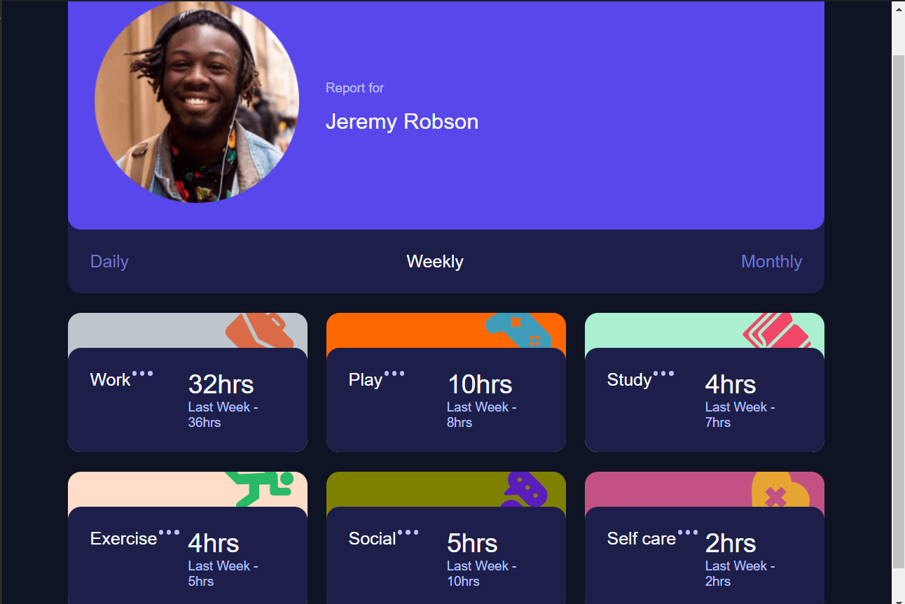
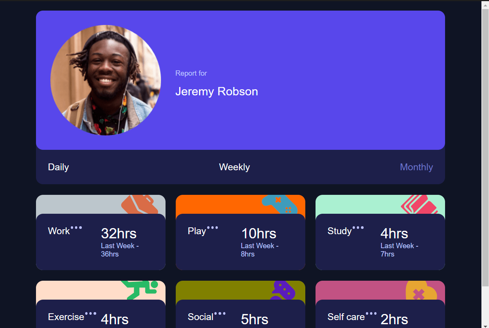
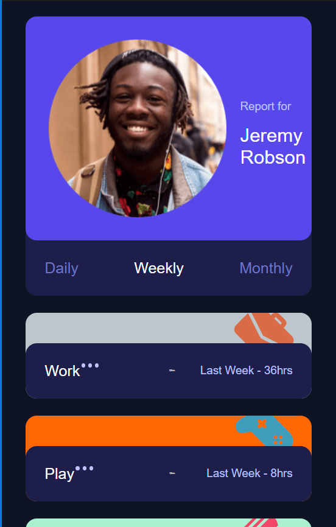

# Quiz 2 - Time tracking dashboard solution

This is a solution to the [Time tracking dashboard Quiz 2 challenge]

## Table of contents

- [Overview](#overview)
  - [The challenge](#the-challenge)
  - [Screenshot](#screenshot)
  - [Links](#links)
- [My process](#my-process)
  - [Built with](#built-with)
  - [What I learned](#what-i-learned)
  - [Continued development](#continued-development)
  - [Useful resources](#useful-resources)
- [Author](#author)
- [Acknowledgments](#acknowledgments)


## Overview

### The challenge

Users should be able to:

- View the optimal layout for the site depending on their device's screen size
- See hover states for all interactive elements on the page
- Switch between viewing Daily, Weekly, and Monthly stats

### Screenshot






### Links

- Solution URL: [https://github.com/AdyatamaMH/time-tracking-dashboard-main]
- Live Site URL: [https://adyatamamh.github.io/time-tracking-dashboard-main/]

## My process

### Built with

- Semantic HTML5 markup
- CSS custom properties
- Flexbox
- CSS Grid
- Webkit-box
- ms-flex
- [Styled Components](https://styled-components.com/) - For styles
- Java Script - For buttons 


### What I learned

I learned two things in CSS that is the use of webkit-box and ms-flex

To see how you can add code snippets, see below:


```css
.contain {
  width: 88%;
  margin: 20px auto;
  display: -webkit-box;
  display: -ms-flexbox;
  display: flex;
  -webkit-box-orient: vertical;
  -webkit-box-direction: normal;
      -ms-flex-direction: column;
          flex-direction: column;
  -webkit-box-align: center;
      -ms-flex-align: center;
          align-items: center;
  -webkit-box-pack: center;
      -ms-flex-pack: center;
          justify-content: center;
  gap: 22px;
}
```

### Continued development

### Useful resources

- [Example resource 1](https://css-tricks.com/using-flexbox/) - This helped me for many reasons. because it helped me on making the boxes have many display functions without colliding with each other and making it easier to implement.


## Your Detail 

- FullName - Adyatama Mahabarata
- StudentID - 2602158626
- BINUS Email - adyatama.mahabarata@binus.ac.id

## Acknowledgments

- CARLO NATHANAEL BESSIE
- ABDULLAH AKMAL SUTOYO
